# EMLO Session 6

The objective of this class is to start/install and run Kubeflow pipeline and train a Pytorch Resnet18 model on the CIFAR dataset.

# Requirements
- [x] 3-4 different runs
- [x] change the model to resnet18
- [x] train for 3-4 epochs (3 done)
- [x] tensorboard loss curve
- [x] confusion matix

# Preparing Piepline

To run the pipeline, we need to generate it first. This was done from the samples provided. However, a few changes were made; these changes are mentioned in the next section

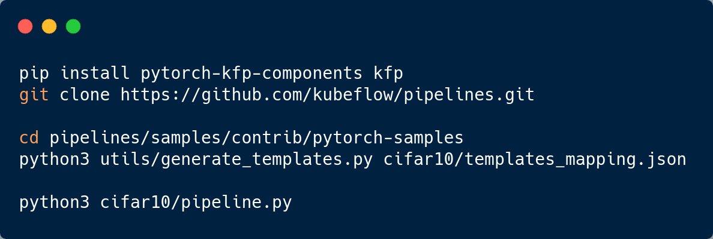

Running the first `python3` command generates a folder called `yaml`. Executing the last step generates a file `pytorch_cifar10.yaml` that is the pipeline.

# Changes Made

## Model

In the files `classifier.py` and `cifar10_train.py`, the model (specified using `self.model_conv`) was changes from resnet50 to resnet18.

## Typo

After generating the YAML files, there was a few typos that had to be fixed. In the files `ax_train_component.yaml`, `train_component.yaml`, and `preprocess_component.yaml`, the key `command` had an incorrect value (`"command to execute"`), and had to be changed to the example specified in the comment.

## Epochs

In `pipeline.py`, we changed `max_epochs=3` in the `ptl_args` string.

changes made resnet 
and [command to execute']

# Installation

As instructed on the [Local Deployment](https://www.kubeflow.org/docs/components/pipelines/installation/localcluster-deployment/) page, K3s was installed. 

`Kind` and `minikube` gave errors (twice) while creating the pipeline - K3s only gave a single warning regarding the versioning. K3ai actually ran k3s in the background.

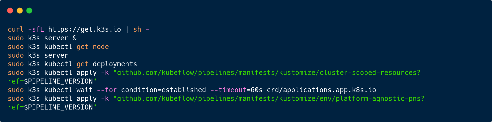

At this step, we wait till all pods have either the Running/Completed state. This takes a long time since it downloads images.

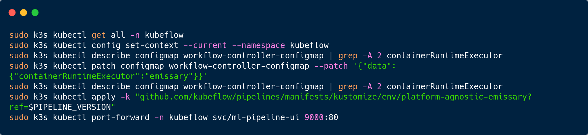

# Running Pipeline

The last step above can be used to start the Pipeline.

### Create Experiment

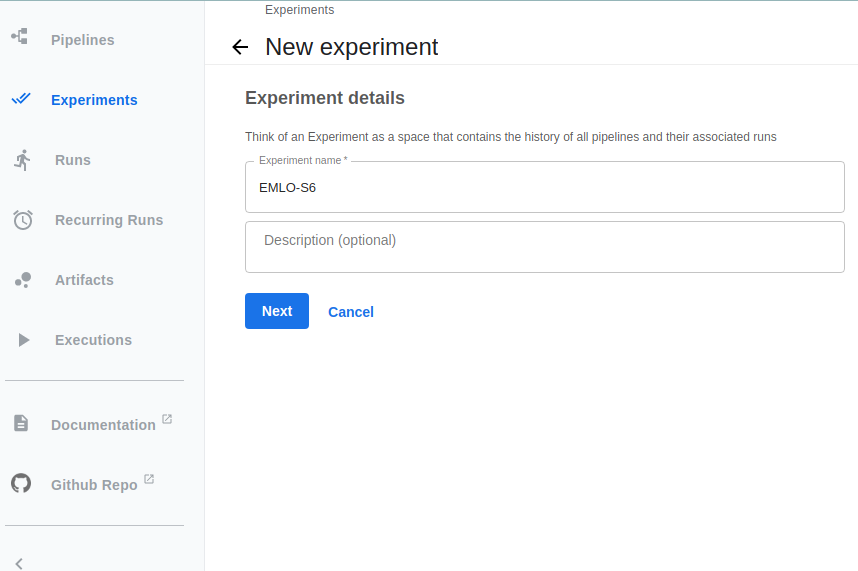

### Upload Pipeline

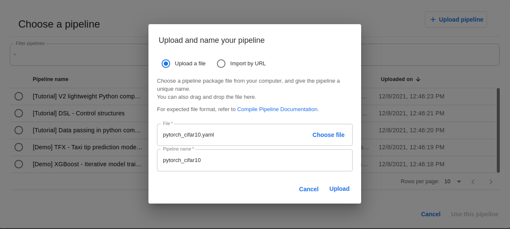

### Create Run

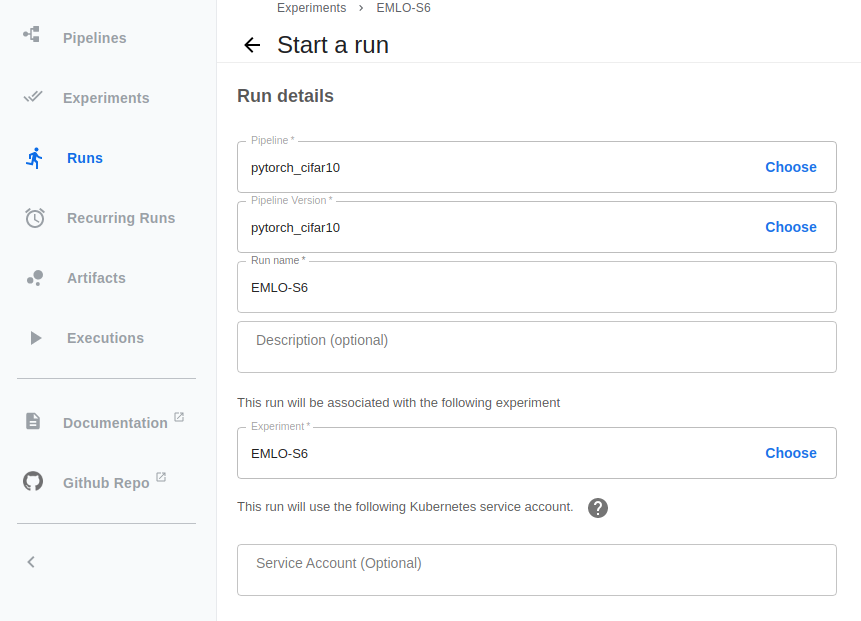

### Start Run
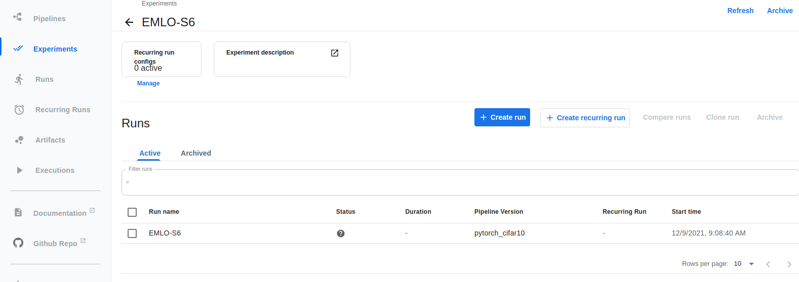

### Running Visualization Part
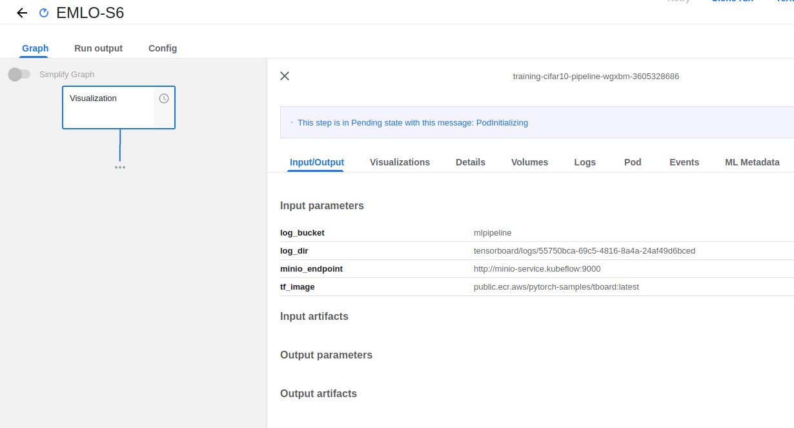

### After Visualization Part Completes

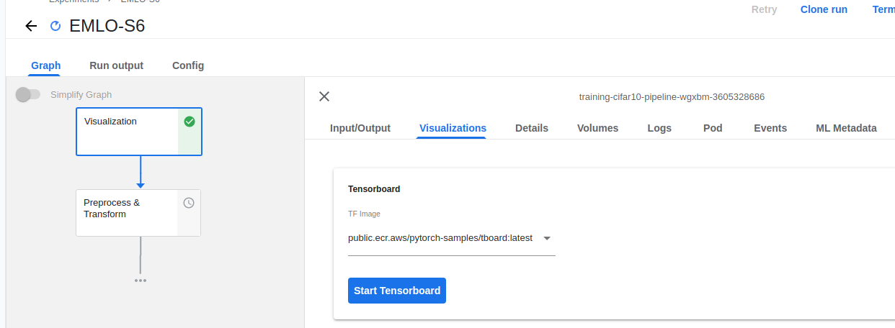

### Running Preprocess/Transform Part

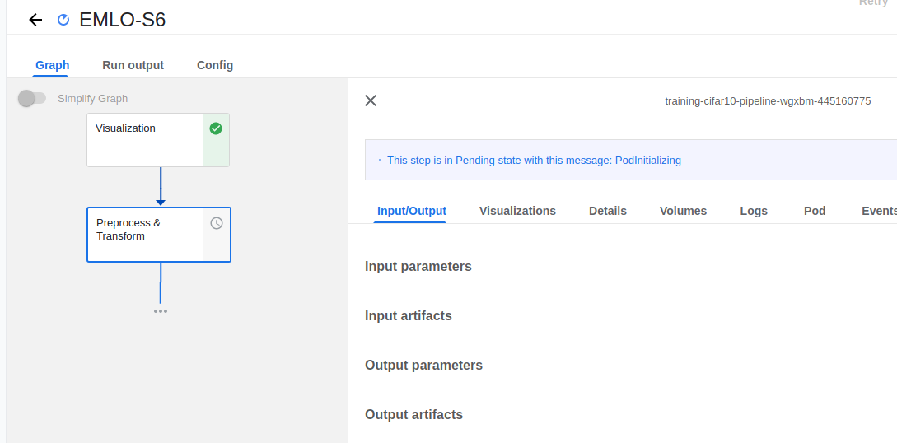

### After Preprocess/Transform Part Completes

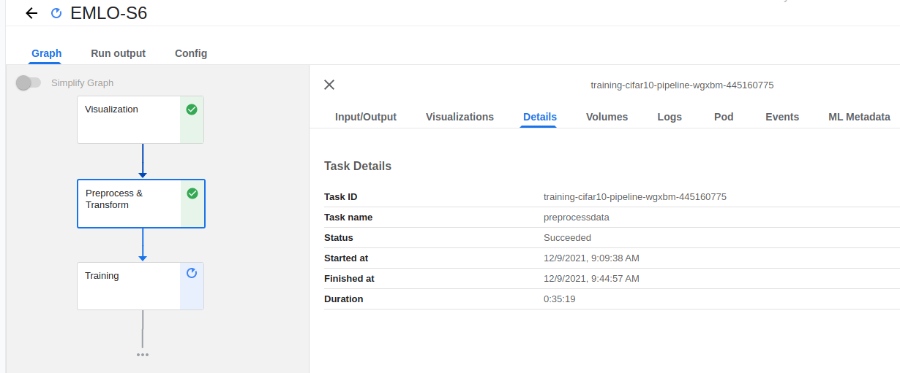

### Running Training Part

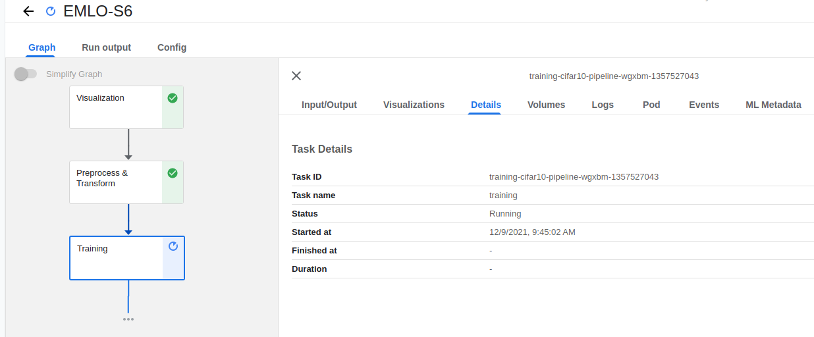

### Training - Epoch 1 Starts
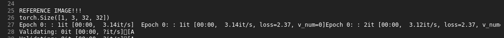

### Training - Epoch 1 Ends

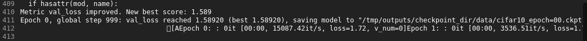

### Training - Epoch 2 Ends

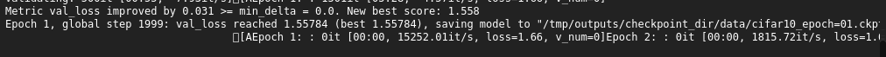

### Training - Epoch 3 Ends

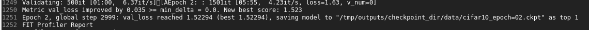

### Training Ends - Profiler

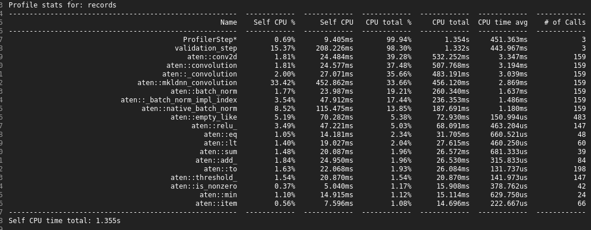

### Training Ends - Graph

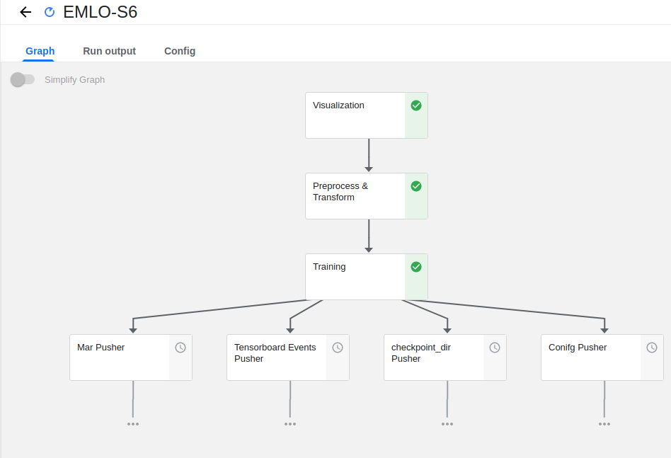

### Training Ends - Success Message

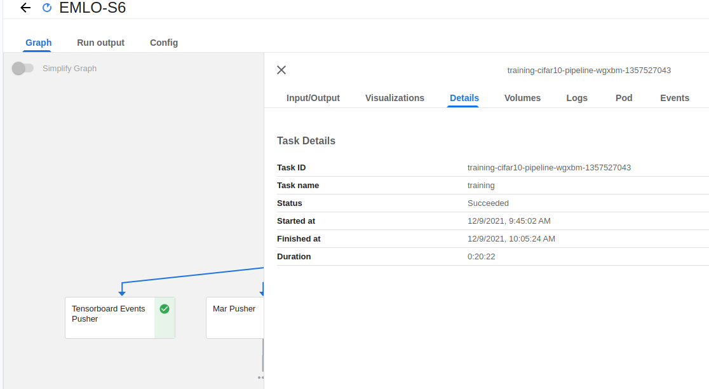

### Pipeline Ends - Graph

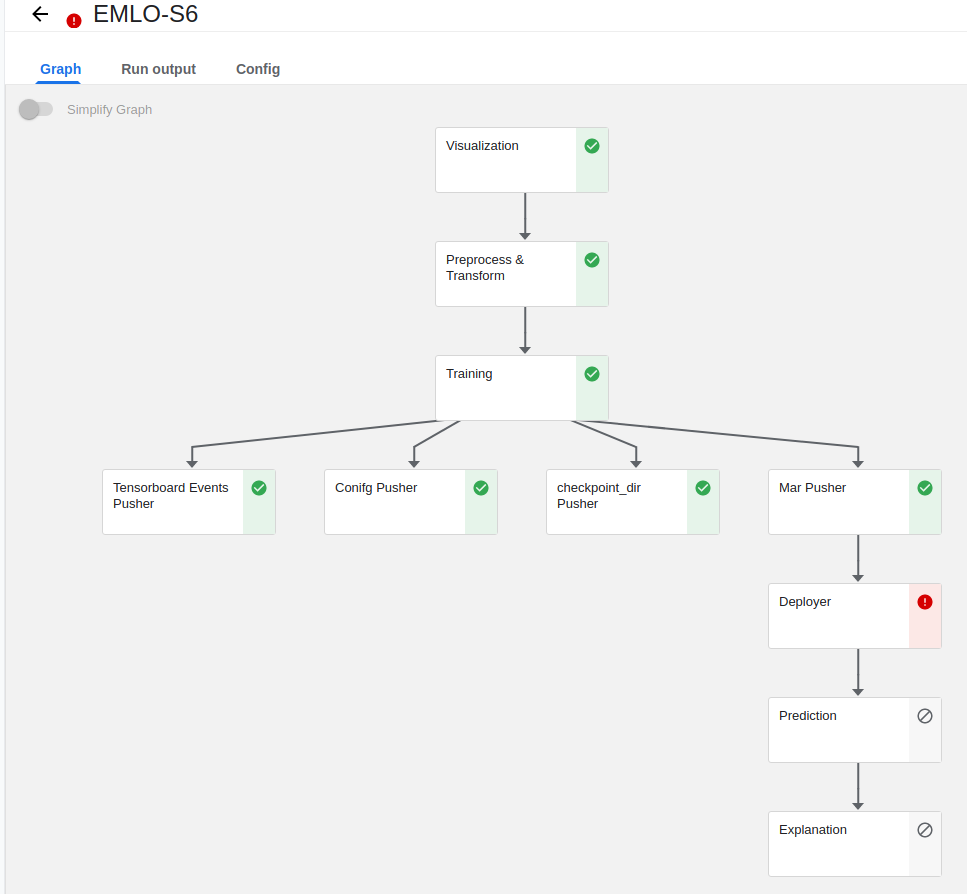
# Tensorboard Curves

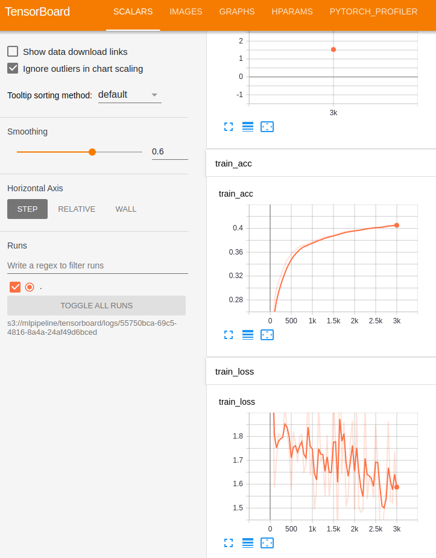

# Confusion Matrix

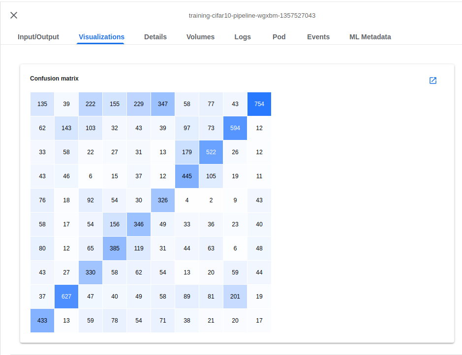

# Profiler

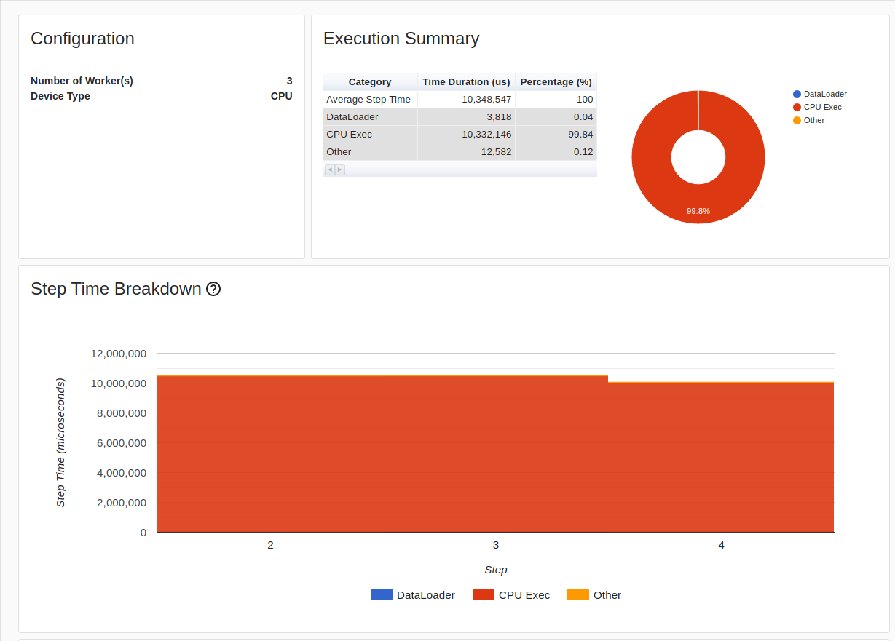

# Multiple Runs

Subsequent Runs were much faster since docker images and other data need not be downloaded. This can be seen in the `duration` column below.

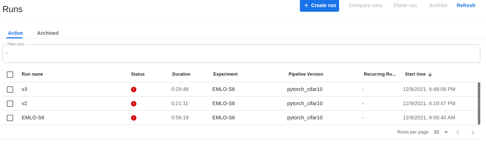

